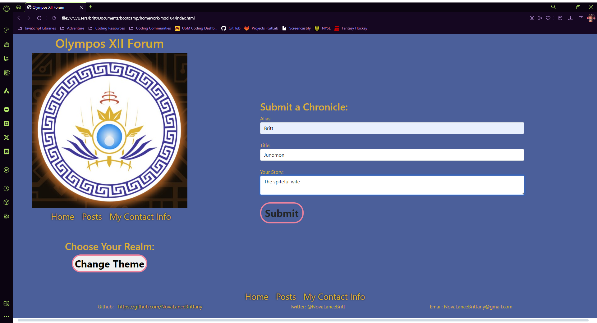
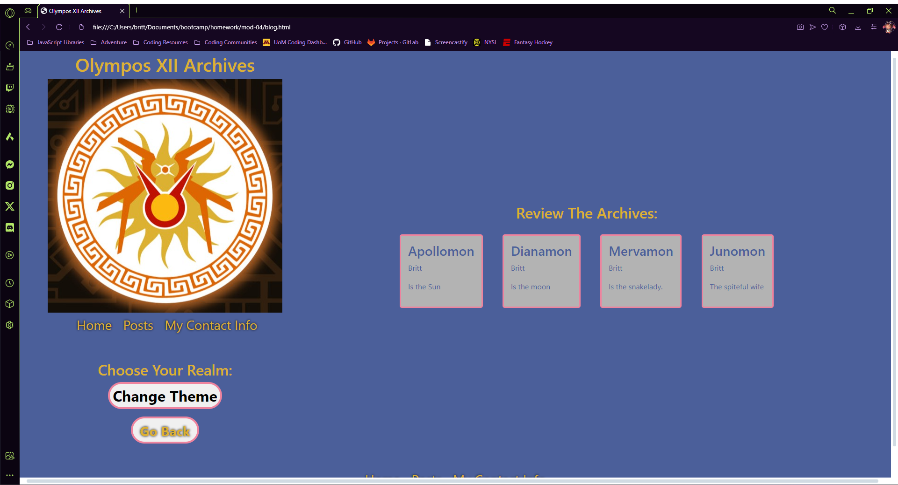
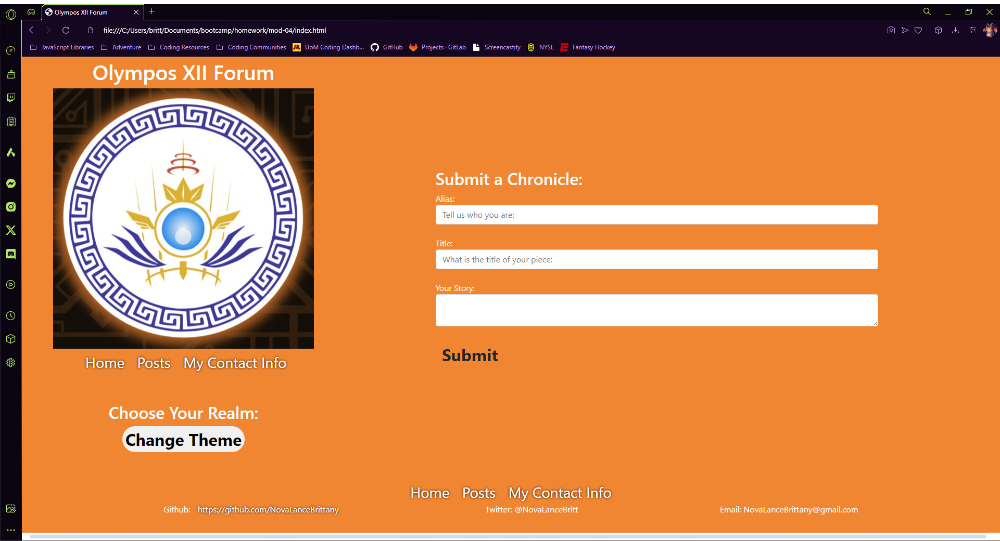
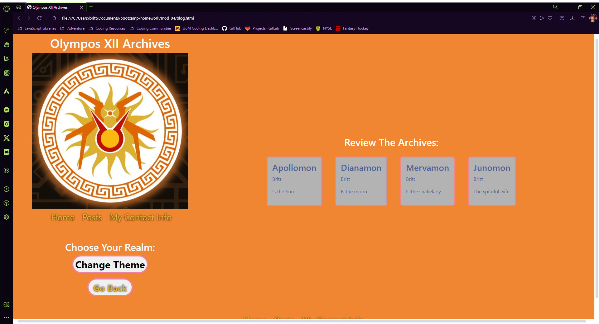

# HW-04 Blog Start Up

## The Challenge:

In this challenge, you'll create a two-page website where users will input and view blog posts. It includes building a content form, dynamically rendering blog posts, and implementing a light/dark mode toggle. As you code, you'll gain practical JavaScript experience, explore the Document Object Model's power, and set the stage for more advanced tasks.

## Project Conduction: 

I created a 2 page blog website for personal use. I have provided a space that allows for personal thoughts and experiences to be expressed. 

## Acceptance Criteria:

- The Landing Page should contain a form with lables and imputs for a Username, Blog Title, and Blog Content.

- Once the form is submitted it is stored to LocalStorage.

- Once the form is submitted the User is redirected to the posts page. 

- If the form is submitted with out a username, title, or content - A message should appear that prompts to complete the form.

- The Posts Page should contain a header and a light / dark mode toggle setting. 

- When the light/dark mode toggle setting is engaged, the page styles should update to reflect the selected setting. 

- The Post Page should have a functional 'Back' button to redirect the User to the Landing Page. 

- When main content is viewed by the User, they are presented with a list of blog posts that are pulled from localStorage.

- When localStorage is viewed by the User, they are presented with a JSON array of blog post objects, each including the author's username, title of the post, and the post's content. 

- When the User takes a closer look at a single blog entry in the list, they are able to see the title, the blog content, and the author of the post. 

- When the User views the footer, they are presented with a link to the develpoer's portfolio. 

## Mock-Up: 

The following images demonstrates the application functionality:

A user can review all of the submitted posts.

A user can experience this blog in light mode or darkmode

## The Deployment:

[The Repo:](https://github.com/NovaLanceBrittany/HW-04-Blog-Start-Up)

[The Deployment:](https://novalancebrittany.github.io/HW-04-Blog-Start-Up/)